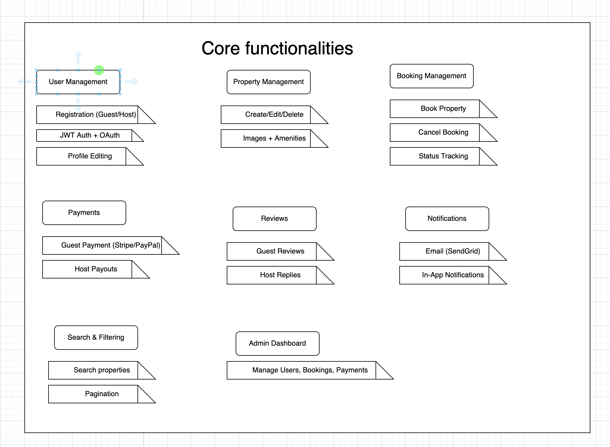

# Airbnb Clone Backend – Project Requirements

## Objective

Design and implement a scalable, secure, and robust backend for an Airbnb-style rental marketplace. This includes core features like user authentication, property listings, booking management, payment processing, and admin tools.

---

## Core Functionalities

### 1. User Management

- **User Registration**
  - Sign up as Guest or Host
  - Secure authentication using JWT
- **User Login**
  - Login via Email and Password
  - Support for OAuth (e.g., Google, Facebook)
- **Profile Management**
  - Update profile info: photo, contact details, preferences

### 2. Property Listings Management

- Hosts can:
  - Add new listings with details (title, description, location, price, amenities, availability)
  - Edit or delete existing listings

### 3. Search and Filtering

- Search listings by:
  - Location
  - Price range
  - Number of guests
  - Amenities (Wi-Fi, pool, pet-friendly)
- Support pagination for large datasets

### 4. Booking Management

- Guests can:
  - Create bookings for specified dates
  - Cancel bookings (based on cancellation policy)
- Booking system supports:
  - Preventing double bookings
  - Tracking booking statuses: pending, confirmed, canceled, completed

### 5. Payment Integration

- Support secure payments through:
  - Stripe, PayPal
- Features:
  - Guest pays upfront
  - Host receives payouts after completion
  - Support for multiple currencies

### 6. Reviews and Ratings

- Guests can:
  - Leave reviews and ratings
- Hosts can:
  - Respond to reviews
- Constraints:
  - Reviews are tied to actual bookings

### 7. Notification System

- In-app and email notifications for:
  - Booking confirmations
  - Cancellations
  - Payment status updates
- Use services like SendGrid or Mailgun

### 8. Admin Dashboard

- Admins can:
  - Monitor and manage users, properties, bookings, payments
  - Moderate reviews and resolve issues

---

## Technical Requirements

### 1. 🗃️ Database Management

- Use a relational DBMS like PostgreSQL or MySQL
- Required tables:
  - `Users`
  - `Properties`
  - `Bookings`
  - `Payments`
  - `Reviews`

### 2. API Development

- Use RESTful API standards
- HTTP Methods: `GET`, `POST`, `PUT/PATCH`, `DELETE`
- Optional: GraphQL for complex queries

### 3. Authentication & Authorization

- Use JWT tokens for sessions
- Role-Based Access Control (RBAC) for:
  - Guest, Host, Admin access levels

### 4. File Storage

- Store images (property photos, profile pics)
- Use local storage for now (with potential cloud migration)

### 5. Third-Party Services

- Use services like:
  - SendGrid/Mailgun for emails
  - Stripe/PayPal for payments

### 6. Error Handling and Logging

- Centralized error handling
- Logging API activity and system events

---

## Non-Functional Requirements

### 1. Scalability

- Modular codebase
- Support horizontal scaling (e.g., load balancers)

### 2. Security

- Passwords hashed
- Payment data encrypted
- Rate limiting, firewalls, and API throttling

### 3. Performance Optimization

- Use caching tools (e.g., Redis)
- Optimize DB queries

### 4. Testing

- Unit tests
- Integration tests
- Automated API testing with tools like `Postman` or `pytest`

---

## File Organization Suggestion

```bash
alx-airbnb-project-documentation/
├── features-and-functionalities/
│   └── airbnb-backend-features.png
```

## Feature Image


